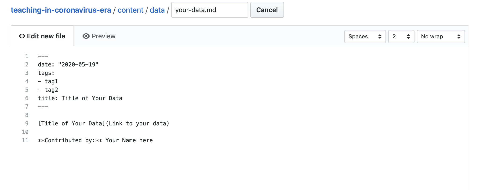

# Teaching Statistics in the Coronavirus Era

Lucy D'Agostino McGowan, Laura Le, Kari Lock Morgan

This repository builds the website that was created to accompany the eCOTS panel [Engaging Students during the COVID-19 Health Crisis](https://www.causeweb.org/cause/ecots/ecots20/panels/2).

<!-- badges: start -->
<!-- badges: end -->

Do you have data to add? You can either:

1. Add it yourself and submit a pull request
2. [Submit an issue](https://github.com/LucyMcGowan/teaching-in-coronavirus-era/issues/new) and I will add it

If you opt for #1, here is the easiest way to do this (especially if you are not familiar with GitHub). 

## 0. Create a GitHub account if you don't already have one
## 1. Fork this repo


## 2. Click `content` then `data`


then


## 3. Click `Create new file`


## 4. Name your file (make sure the name is **unique** and ends with `.md`


## 5. Paste the following into the `Edit new file` window and add the information about the data you would like to link to. This should _minimally_ include a link to the dataset, one tag the dataset can be searched by, and your name under **Contributed by**. 

```
---
date: "2020-05-19"
tags:
- tag1
- tag2
title: Title of Your Data
---

[Title of Your Data](Link to your data)

**Contributed by:** Your Name here
```




## 6. Click `Commit new file`


## 7. Click `Pull request` to submit your new data as a pull request to the website


## 8. Click `Create Pull Request` then `Create Pull Request` again. and you're done!


