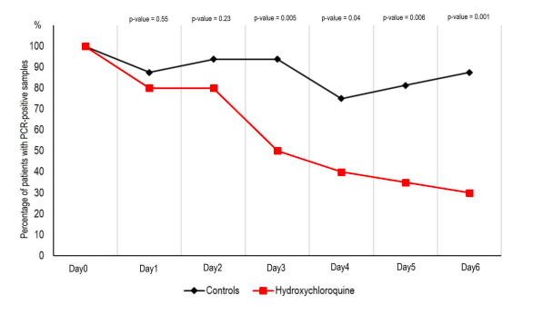

## Hydroxychloroquine

<!--
  - Chloroquine found to have a significant effect against COVID-19 on Chinese patients \footnote{Gao J, Tian Z, Yang X. (Breakthrough: Chloroquine phosphate has shown apparent
efficacy in treatment of COVID-19 associated pneumonia in clinical studies)[https://www.jstage.jst.go.jp/article/bst/advpub/0/advpub_2020.01047/_article]. Biosci Trends
2020 Feb 19. doi: 10.5582/bst.2020.01047.}-->
  - Anti-malaria drug (not antiviral)
  - Related to chloroquine (but not identical)
  - Shown to be effective against SARS-CoV activity *in vitro* [Wang M et al, 2020](https://www.nature.com/articles/s41422-020-0282-0) [Biot C et al, 2006](https://pubs.acs.org/doi/10.1021/jm0601856)
  - Early human studies have suggested that it might be effective against COVID-19 (China, France)

  
## The Study

  - We'll look at a French study that provided data (not an exhaustive literature review!)
  - [Gautret P, et al (2020). Hydroxychloroquine and azithromycin as a treatment of COVID-19: results of an open- label non-randomized clinical trial](https://www.sciencedirect.com/science/article/pii/S0924857920300996?via%3Dihub)
  - International Journal of Antimicrobial Agents
  - Peer-reviewed 
  - But...
      - accepted in less than a day
      - one of the authors is Editor-in-Chief of the journal
  - Lots of problems with this study (we'll get into)
  - But... they provide their data!

## Figure 1




## Data

```{r}
raw.dat = read.csv("chloroquine.csv")
head(raw.dat)
```

## PCR {.build}

  - PCR = polymerise chain reaction test for COVID-19
  - Directly test for the presence of COVID-19 antigen (as opposed to testing for the bodies immune response)
  - False negatives can occur up to 30% of the time
  - Given as CT values (the number of cycles after which a PCR becomes positive, the lower the number, the more virus is present)
  - NEG if $\geq 35$ 
  - Measured at days 0-6 (D0, D1, D2, D3, D4, D5, D6)

```{r}
raw.dat$D0
```

## Cleaning PCR

```{r}
raw.dat$D0
```

```{r, message=F, warning=F}
cleaned.dat = raw.dat
for (j in 10:16) {
  cleaned.dat[,j][raw.dat[,j]=="ND"] = NA
  cleaned.dat[,j][as.numeric(as.character(raw.dat[,j]))<35] = "POS"
  cleaned.dat[,j][as.numeric(as.character(raw.dat[,j]))>=35] = "NEG"
}
cleaned.dat = droplevels(cleaned.dat)
cleaned.dat$D0
```

## What should we do next with the data? {.build}

 - Remove outcomes!
 
```{r, message=F}
names(cleaned.dat)
dat = cleaned.dat[,-c(11:16)]
names(dat)
```

## Making Treatment 0/1 {.build}

```{r, message=F}
library("tidyverse")
dat = dat %>%
  mutate(Hydroxychloroquine = recode(Hydroxychloroquine, "Yes"= 1, "No"=0))
```

What do we want to know about treatment???


## Assignment Mechanism {.build}

"French Confirmed COVID-19 patients were included in a single arm protocol from early
March to March 16th, to receive 600mg of hydroxychloroquine daily and their viral load in
nasopharyngeal swabs was tested daily in a hospital setting. Depending on their clinical
presentation, azithromycin was added to the treatment. Untreated patients from another center
and cases refusing the protocol were included as negative controls."

"Patients who were proposed a treatment with hydroxychloroquine were recruited
and managed in Marseille centre. Controls without hydroxychloroquine treatment were
recruited in Marseille, Nice, Avignon and Briançon centers, all located in South France."

=> Give up?

## Covariates {.build}

```{r}
names(dat)
```

  - Age
  - Sex
  - ClinicalStatus
  - TimeBeforeInclusion
  - D0
  
Unconfounded???
  
## Age {.build}

```{r}
boxplot(dat$Age~dat$Hydroxychloroquine)
```

<!--
This is problematic, but should work *against* Hydroxychloroquine (older people fare worse with COVID-19)-->

## Sex

```{r}
table(dat$Hydroxychloroquine, dat$Sex)
```

## Time Before Inclusion

```{r}
boxplot(dat$TimeBeforeInclusion~dat$Hydroxychloroquine)
```


## Clinical Presentation {.build}

```{r}
table(dat$Hydroxychloroquine, dat$ClinicalStatus)
```

- URTI = Upper Respiratory Tract Infection
- LRTI = Lower Respiratory Tract Infection (Pneumonia confirmed in all)
- Again imbalanced, but again in favor of control

## Binary for Balance Assessment

```{r}
source("/Users/Kari/OneDrive - The Pennsylvania State University/Teaching/Causal/CausalFunctions.R")
dat = cbind(dat, dummies(dat$ClinicalStatus))
```

## Day 0 

All positive at baseline:

```{r}
table(dat$Hydroxychloroquine, dat$D0)
```

## Day 0: Numeric Values Only {.build}

```{r}
table(raw.dat$Hydroxychloroquine, !(raw.dat$D0 == "POS" | raw.dat$D0 == "ND"))
```

## Day 0: Numeric Values Only {.build}

```{r}
boxplot(as.numeric(as.character(raw.dat$D0))~raw.dat$Hydroxychloroquine)
```


## Love Plot {.build}

```{r, eval=F}
covs = c("Age", "Sex", "TimeBeforeInclusion", "Asymptomatic", "URTI","LRTI")
x = select(dat, one_of(covs))
cov.balance(x, dat$Hydroxychloroquine)
```

Error in plot.window(...) : need finite 'xlim' values

```{r}
table(dat$Sex)
dat = mutate(dat, Female = recode(Sex, "F" = 1, "M" = 0))
```

## Love Plot
```{r}
covs = c("Age", "Female", "TimeBeforeInclusion", "Asymptomatic", "URTI","LRTI")
x = select(dat, one_of(covs))
cov.balance(x, dat$Hydroxychloroquine, left.mar = 1.8)
```

## Covariate Balance

  - Relatively good balance on observed covariates
  - Propensity score methods won't change the results much
  - What's the real problem here?
  - The problem is the ***unobserved covariates***

## Assignment Mechanism {.build}

"French Confirmed COVID-19 patients were included in a single arm protocol from early
March to March 16th, to receive 600mg of hydroxychloroquine daily and their viral load in
nasopharyngeal swabs was tested daily in a hospital setting. Depending on their clinical
presentation, azithromycin was added to the treatment. Untreated patients from another center
and cases refusing the protocol were included as negative controls."

"Patients who were proposed a treatment with hydroxychloroquine were recruited
and managed in Marseille centre. Controls without hydroxychloroquine treatment were
recruited in Marseille, Nice, Avignon and Briançon centers, all located in South France."

## Unobserved Covariates
  
  - Treatment groups drawn from different locations 
  - Different types of people
  - Different types of care
  - What's different about people who refused the protocol?
  - Absolutely no way to balance these aspects!
  - ***IMPORTANT***: Propensity score methods can only correct for imbalance on ***observed covariates***.  


## Propensity Score {.build}

  - TimeBeforeInclusion is based on onset of symptoms - missing for asymptomatic individuals.  
  - It's well-balanced anyway, so exclude from propensity score model.)
  
```{r}
ps.model = glm(Hydroxychloroquine~Age+Female+Asymptomatic+URTI, data = dat, family=binomial(link = "logit"))
summary(ps.model)$coefficients
```

## Estimated Propensity Scores

```{r}
lps = predict(ps.model)
plot.ps(lps, dat$Hydroxychloroquine)
```

## Overlap {.build}

```{r}
overlap(lps, dat$Hydroxychloroquine)
```

```{r}
table(dat$Hydroxychloroquine)
```

- Should we trim???

## Trimmed Sample

```{r}
trim = lps<min(lps[dat$Hydroxychloroquine==1]) | lps > max(lps[dat$Hydroxychloroquine==0])
trimmed.units = dat$Patient[trim]
trimmed.dat = dat[!trim,]
ps.model = glm(Hydroxychloroquine~Age+Female+Asymptomatic+URTI, data = trimmed.dat, family=binomial(link = "logit"))
lps = predict(ps.model)
overlap(lps, trimmed.dat$Hydroxychloroquine)
kept = rep(TRUE, dim(dat)[1])
kept[trimmed.units] = FALSE
```


## Trimmed Sample: Repeat

```{r}
trim = lps<min(lps[trimmed.dat$Hydroxychloroquine==1]) | lps > max(lps[trimmed.dat$Hydroxychloroquine==0])
trimmed.units = c(trimmed.units, trimmed.dat$Patient[trim])
trimmed.dat = trimmed.dat[!trim,]
ps.model = glm(Hydroxychloroquine~Age+Female+Asymptomatic+URTI, data = trimmed.dat, family=binomial(link = "logit"))
lps = predict(ps.model)
overlap(lps, trimmed.dat$Hydroxychloroquine)
kept = rep(TRUE, dim(dat)[1])
kept[trimmed.units] = FALSE
```

## Who did we drop? {.build}

```{r}
dat[!kept,1:5]
```

- All the asymptomatic individuals (and 2 others)
- Easier to explain: just drop asymptomatic individuals?


## Propensity Scores after Trimming

```{r}
plot.ps(lps, trimmed.dat$Hydroxychloroquine)
```

## Covariate Balance after Trimming

```{r}
covs = c("Age", "Female", "TimeBeforeInclusion", "URTI","LRTI")
x = select(dat, one_of(covs))
x.trimmed = select(trimmed.dat, one_of(covs))
cov.balance(x, dat$Hydroxychloroquine, new.x = x[kept,], new.w = trimmed.dat$Hydroxychloroquine, left.mar = 1.8)
```

## Subclassification {.build}

- How many subclasses?
```{r}
table(trimmed.dat$Hydroxychloroquine)
```

## Subclassification

```{r}
breaks = quantile(lps, .5)
breaks
subclass = subclasses(lps, breaks = breaks)
subclass
```

## Subclassification

```{r}
plot.ps(lps, trimmed.dat$Hydroxychloroquine, breaks = breaks)
```

## Covariate Balance

```{r}
cov.balance(x=x.trimmed, w=trimmed.dat$Hydroxychloroquine, subclass=subclass, left.mar = 1.8)
```

## Subclass Balance
```{r}
library(knitr)
kable(round(subclass.balance(x.trimmed, trimmed.dat$Hydroxychloroquine, subclass = subclass),2))
```

## Trimmed Units Back
```{r}
ps.model = glm(Hydroxychloroquine~Age+Female+Asymptomatic+URTI, data = dat, family=binomial(link = "logit"))
lps = predict(ps.model)
```

## Subclassification {.build}

- How many subclasses?
```{r}
table(dat$Hydroxychloroquine)
breaks = quantile(lps, c(.33, .67))
breaks
subclass = subclasses(lps, breaks = breaks)
subclass
```

## Subclassification

```{r}
plot.ps(lps, dat$Hydroxychloroquine, breaks = breaks)
```

## Covariate Balance

```{r}
covs = c("Age", "Female", "TimeBeforeInclusion", "LRTI","URTI","Asymptomatic")
x = select(dat, one_of(covs))
cov.balance(x=x, w=dat$Hydroxychloroquine, subclass=subclass, left.mar = 1.8)
```

## Subclass Balance
```{r}
diff.means.results = as.data.frame(matrix(NA, nrow=3, ncol=length(covs)))
names(diff.means.results) = covs
row.names(diff.means.results) = c("Raw", "Subclassification (after trimming)", "Subclassification (no trimming)")
diff.means.results[1,] = round(subclass.balance(x, dat$Hydroxychloroquine, subclass = subclass),2)[1,]
diff.means.results[2,1:5]= round(subclass.balance(x.trimmed, trimmed.dat$Hydroxychloroquine, subclass = subclass),2)[2,]
diff.means.results[3,] = round(subclass.balance(x, dat$Hydroxychloroquine, subclass = subclass),2)[2,]

kable(diff.means.results)
```

## Outcome Data

"The primary endpoint was virological clearance at day-6 post-inclusion."

```{r}
y = rep(NA, dim(dat)[1])
y[cleaned.dat$D6=="POS"] = 1
y[cleaned.dat$D6=="NEG"] = 0
w = dat$Hydroxychloroquine
```

## Raw Data

```{r}
prop.table(table(dat$Hydroxychloroquine, y),1)
```

- `r round(mean(y[w==1], na.rm=T),2)*100`% tested positive after 6 days of treatment
- `r round(mean(y[w==0], na.rm=T),2)*100`% tested positive after 6 days of no treatment
- Estimated treatment effect (difference in proportions): `r round(mean(y[w==1], na.rm=T)- mean(y[w==0], na.rm=T),2)`

## After Subclassification {.build}

```{r}
subclass.average(y, dat$Hydroxychloroquine, subclass = subclass)
```

- Exact same overall result.
- (Not surprising - balance on *observed* covariates was pretty good to begin with)
- With larger samples we might read into the differences across subclasses (treatment effect better for those most likely to be treated), but within subclasses samples too small to say much of anything here

## Variance

```{r}
subclass.var(y, dat$Hydroxychloroquine, subclass = subclass)
```

## Problems 

  - Imbalance on observed covariates was not the problem with this study.  
  - ***THIS IS ALL PROPENSITY SCORE METHODS ARE ABLE TO FIX***
  - What *are* the problems?
  
## Problem 1: Unobserved Covariates

We have absolutely no way of knowing whether the observed differences are due to...
  
  - the treatment
  - the fact that people who come to Marseille centre may differ at baseline from people who come to other centres in the south of France
  - the fact that the level of care may be different at Marseille center than the other centres 
  - the fact that people who refused the protocol were lumped into the control group
  - something else...
  

## Problem 2: Attrition {.build}

```{r}
sum(is.na(y))
table(is.na(y), dat$Hydroxychloroquine)
```

## Problem 2: Attrition

- In the paper, they looked at the number of negative test results, lumping "not determined" with the positive results!  
- This certainly biases their results against the control group!!


## Problem 2: Attrition

The units with "not determined" PCR at Day 6:

```{r}
cleaned.dat[is.na(y),c(10:16)]
```

## Problem 2: Attrition {.build}

 - Missing at random?
 - How to deal with a variable that's part numeric and part factor in imputation???
 
```{r, message =F, eval=F}
dat = raw.dat
for (j in 10:16) dat[,j][dat[,j]=="ND"] = NA
dat = droplevels(dat)
M = 5
imp = mice(dat, m = M)
imp.dat = vector("list", M)
for (m in 1:M) imp.dat[[m]] = complete(imp, action = m)
save(imp.dat, file="imp.rData")
```

```{r}
M=5
load("imp.rData")
```

## Problem 2: Attrition

```{r, warning=F, message=F}
library(mice)
for (m in 1:5) {
  imp.dat[[m]]$D6[as.numeric(as.character(imp.dat[[m]]$D6))<35] = "POS"
  imp.dat[[m]]$D6[as.numeric(as.character(imp.dat[[m]]$D6))>=35] = "NEG"
}
ests = rep(NA,m)
for (m in 1:M) ests[m] = mean(imp.dat[[m]]$D6[imp.dat[[m]]$Hydroxychloroquine=="Yes"]=="POS")-mean(imp.dat[[m]]$D6[imp.dat[[m]]$Hydroxychloroquine=="No"]=="POS")
ests
mean(ests)
```

## Problem 2: Attrition {.build}

Imputing after dichotomizing PCR results:
```{r, message =F, warning=F, results=F}
dat = cleaned.dat
imp = mice(dat, m = M)
imp.dat = vector("list", M)
for (m in 1:M) imp.dat[[m]] = complete(imp, action = m)
for (m in 1:M) ests[m] = mean(imp.dat[[m]]$D6[imp.dat[[m]]$Hydroxychloroquine=="Yes"]=="POS")-mean(imp.dat[[m]]$D6[imp.dat[[m]]$Hydroxychloroquine=="No"]=="POS")

```

```{r}
ests
mean(ests)
```

## Problem 2: Attrition {.build}

  - We can only impute the missing outcomes for the people that remained in the study but had "ND" PCR tests.

- However, 6 other units attrited, whom we have no data for.

- Nothing we can do about them analytically
- But we should investigate reasons for attrition

## Problem 2: Attrition {.build}

"Six hydroxychloroquine-treated patients were lost in follow-up during the survey because of early cessation of treatment. Reasons are as follows: three patients were transferred to intensive care unit, including one transferred on day2 post-inclusion who was PCR-positive on day1, one transferred on day3 post-inclusion who was PCR-positive on days1-2 and one transferred on day4 post-inclusion who was PCR-positive on day1 and day3; one patient died on day3 post inclusion and was PCR-negative on day2; one patient decided to leave the hospital on day3 post-inclusion and was PCR-negative on days1-2; finally, one patient stopped the treatment on day3 post-inclusion because of nausea and was PCR-positive on days1-2-3. The results presented here are therefore those of 36 patients (20 hydroxychloroquine-treated patients and 16 control patients). None of the control patients was lost in follow-up."

THIS IS A HUGE PROBLEM!!!

## Problem 3: Azithromycin {.build}

- Azithromycin is an antibiotic

- "Depending on their clinical presentation, azithromycin was added to the treatment."

```{r}
table(dat$Hydroxychloroquine, dat$Azithromycin)
```

- Is the effect due to hydroxychloroquine or azithromycin??

## Problem 3: Azithromycin {.build}

- We can look at the units who received only hydroxychloroquine, but this is injecting certain bias, because patients only received this as needed (probably the sickest patients)


```{r}
prop.table(table(dat$Hydroxychloroquine[dat$Azithromycin=="No"], y[dat$Azithromycin=="No"]),1)
```

- Estimated treatment effect: `r round(mean(y[w==1 & dat$Azithromycin=="No"], na.rm=T)- mean(y[w==0& dat$Azithromycin=="No"], na.rm=T),2)`

## Problem 3: Azithromycin {.build}

Excluding those who received Azithromycin:
```{r}
prop.test(table(dat$Hydroxychloroquine[dat$Azithromycin=="No"], y[dat$Azithromycin=="No"]))
```

## Problem: Units Excluding {.build}

We are now excluding the sickest units from the treatment group for several reasons:

  - got transferred to ICU
  - died
  - needed antibiotics

It's not surprising that those left are healthier!

## Problem 4: Sloppy Work {.build}

"Hospitalized patients with confirmed COVID-19 were included in this study if they fulfilled
two primary criteria: i) age >12 years; ii) PCR documented SARS-CoV-2 carriage in
nasopharyngeal sample at admission whatever their clinical status."

```{r}
min(dat$Age)
```

```{r}
dat$D0
```

## Other Problems and Blog Post

  - Remaining problems are pointed out in [Bik, E. (2020)](https://scienceintegritydigest.com/2020/03/24/thoughts-on-the-gautret-et-al-paper-about-hydroxychloroquine-and-azithromycin-treatment-of-covid-19-infections/).  
  - Highly recommend reading!
  - Highlights many potential problem invalidating any causal conclusions.  
  - Great points to consider for causal inference in general.
  - Bottom links to other posts 

## Problem 5: Breach of Protocol {.build}

"In the [EU Clinical Trial Register page](https://www.clinicaltrialsregister.eu/ctr-search/trial/2020-000890-25/FR), the study was described as evaluating PCR data on Day 1, Day 4, Day 7 and Day 14. However, the study show the data for Day 6, which is different than planned. Why did the authors not show the results on Day 7? Did the data on day 7 not look as good?" 


## Problem 5: Breach of Protocol {.build}

"Assuming a 50% efficacy of hydroxychloroquine in reducing the viral load at day 7, a 85%
power, a type I error rate of 5% and 10% loss to follow-up, we calculated that a total of 48
COVID-19 patients (ie, 24 cases in the hydroxychloroquine group and 24 in the control
group) would be required for the analysis (Fleiss with CC)."

```{r}
table(dat$Hydroxychloroquine)
```

Even with the 6 missing, that still only brings us up to 42...


## "Statistics" section

"Assuming a 50% efficacy of hydroxychloroquine in reducing the viral load at day 7, a 85% power, a type I error rate of 5% and 10% loss to follow-up, we calculated that a total of 48 COVID-19 patients (ie, 24 cases in the hydroxychloroquine group and 24 in the control group) would be required for the analysis (Fleiss with CC). Statistical differences were evaluated by Pearson’s chi-square or Fisher’s exact tests as categorical variables, as appropriate. Means of quantitative data were compared using Student’s t-test. Analyses were performed in Stata version 14.2."

## Twitter Thread

https://twitter.com/JamesTodaroMD/status/1240274548165169157?s=20

## Bayesian Reanalysis of Gautret Data {.build .smaller}

[Reply to Gautret et al. 2020: A Bayesian reanalysis of the effects of hydroxychloroquine and azithromycin on viral carriage in patients with COVID-19](https://www.medrxiv.org/content/10.1101/2020.03.31.20048777v1)
 
 "Here we apply Bayesian statistics to assess the robustness of the original papers claims by testing four variants of the data: 1) The original data; 2) Data including patients who deteriorated; 3) Data including patients who deteriorated with exclusion of untested patients in the comparison group; 4) Data that includes patients who deteriorated with the assumption that untested patients were negative. To ask if HCQ monotherapy is effective, we performed an A/B test for a model which assumes a positive effect, compared to a model of no effect. We find that the statistical evidence is highly sensitive to these data variants. Statistical evidence for the positive effect model ranged from strong for the original data (BF ~11), to moderate when including patients who deteriorated (BF ~4.35), to anecdotal when excluding untested patients (BF ~2), and to anecdotal negative evidence if untested patients were assumed positive (BF ~0.6)."
 

## More Information {.build}

[Hydroxychloroquine Update For April 6](https://blogs.sciencemag.org/pipeline/archives/2020/04/06/hydroxychloroquine-update-for-april-6)

Summarizes several other studies...

## China Randomized Trial


- [Chen, Z, et al. (2020).  Efficacy of hydroxychloroquine in patients with COVID-19: results of a randomized clinical trial](https://www.medrxiv.org/content/10.1101/2020.03.22.20040758v2.full.pdf)
- Preprint, not peer-reviewed
- $n = 62$
- Primary outcome: Time to Clinical Recovery
- Significantly better in treatment group


  

## Paris Observational Study

  - [Study in Paris](https://www.sciencedirect.com/science/article/pii/S0399077X20300858?via%3Dihub)
  - Peer-reviewed
  - $n = 11$ 
  - no treatment effect
  - 8 of the 11 had significant comorbidities
  - One died, 8/10 still positive after days 5/6
  - One had to discontinue treatment because of QT prolongation...

## NYU

  
 - [The QT Interval in Patients with SARS-CoV-2 Infection Treated with
Hydroxychloroquine/Azithromycin ](https://www.medrxiv.org/content/10.1101/2020.04.02.20047050v1.full.pdf)
  - Looked at QT Prolongation with this treatment
  - QT prolongation is a measure of delayed ventricular repolarisation (the heart muscle takes longer than normal to recharge between beats)
  - Known side effect of hydroxychloroquine that can lead to fatal heart arrhythmia
  - $n = 84$
 - 30\% of the sample experienced QT prolongation (!)


## Mouse Data

 - [Fatal toxicity of chloroquine or hydroxychloroquine with metformin in mice](https://www.biorxiv.org/content/10.1101/2020.03.31.018556v1)
 - Dangerous interaction with Metformin (popular drug for diabetics)
 - 30% mortality in mice
 


## US Administration

- [Trump’s Aggressive Advocacy of Malaria Drug for Treating Coronavirus Divides Medical Community](https://www.nytimes.com/2020/04/06/us/politics/coronavirus-trump-malaria-drug.html)
 


<!--
## Time Before Inclusion
```{r}
sum(is.na(trimmed.dat$TimeBeforeInclusion))
```

 - We'll impute the treatment group average (both in control group) because that's besides the point here, but in reality should use multiple imputation
 
```{r}
trimmed.dat$TimeBeforeInclusion[is.na(trimmed.dat$TimeBeforeInclusion)] = mean(trimmed.dat$TimeBeforeInclusion[trimmed.dat$Hydroxychloroquine==0], na.rm=T)
```

## Refit Propensity Scores with TimeBeforeInclusion
```{r}
ps.model = glm(Hydroxychloroquine~Age+Female+URTI+TimeBeforeInclusion, data = trimmed.dat, family=binomial(link = "logit"))
lps = predict(ps.model)
overlap(lps, trimmed.dat$Hydroxychloroquine)
```
-->
